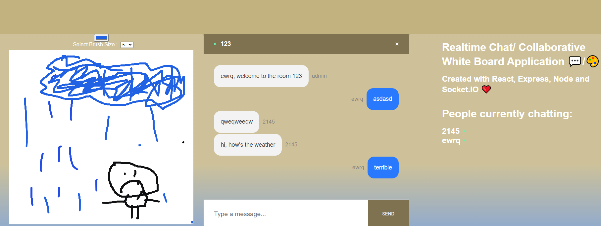
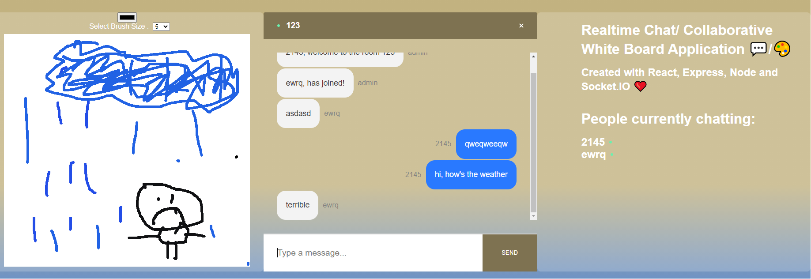

# Sand_Castle

Sand Castle is a simple real time chat room and a collaborative whiteboard. It was made with React, Node.js and Socket.IO, it allows users to join with 
a username into a room and communicate with other users of that group, the ui has a few features including a white board as well as a text view showing
all current users.

https://6026d3ade6a65f2c01b25050--upbeat-babbage-6f5f61.netlify.app

the login page

the perspective of 2 users on the app

